# Color_Switch_Game

## :rocket: Features
* Play a never ending game with ever increasing difficulty, and see how far you are able to go!
* Earn rewards as you do it, a star, or if you are lucky, even a diamond.
* Collect the stars in a economical fashion, and dont spend a lot of them anywhere, you will need them to resume your game even if you lose!
* Use your diamonds to purchase swags from our own shop! Change your ball, or climb across the ranks, from unranked to Recruit to Corporal to finally, GENERAL! Do you think you can beat your friends in the race?
* Discover various 'gifts' from our side as you proceed with the game.  You can expect a surprise at any time ;).
* Got busy in the middle of a game? Save and exit, and resume from the same position some time in the future!
* Keep a track of your stats, and beat your friends!

## :computer: Technical Highlights of the Game
* Object Oriented Code, aimed to make it readable and efficient.
* No unneccessary background processes to ensure smooth play.
* Animations at the places where loading time is needed to improve UI.

## :camera: Screenshots From The Game
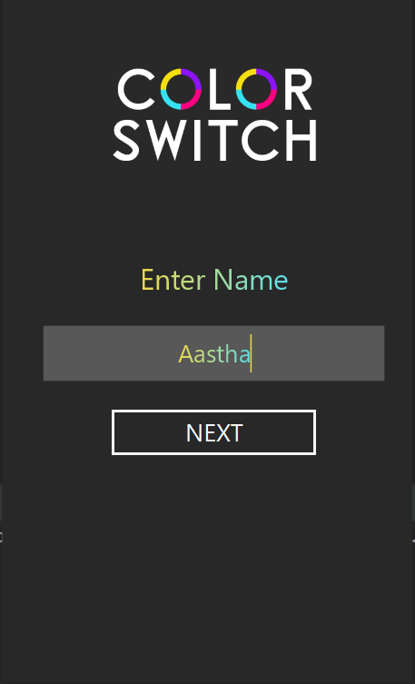
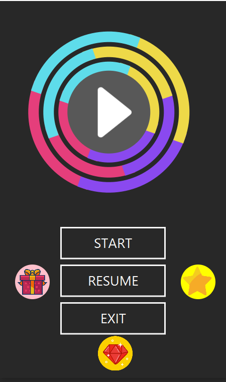

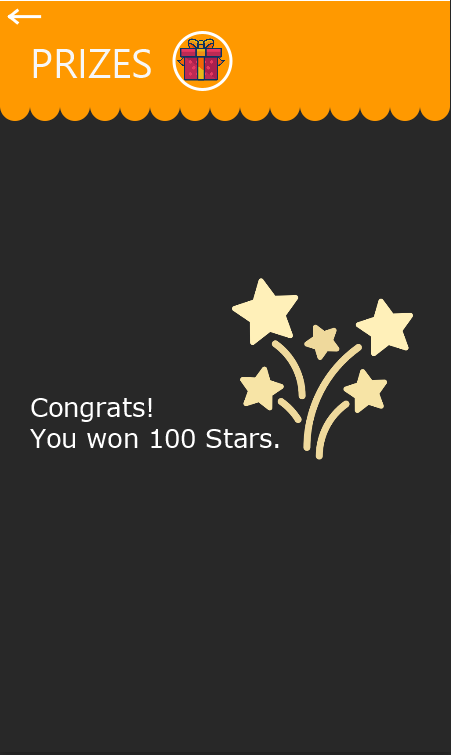
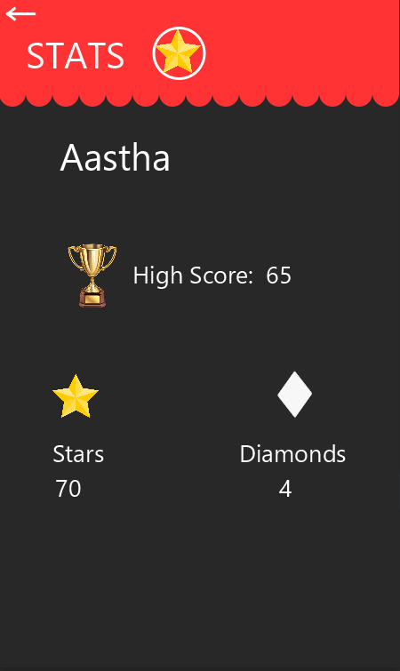

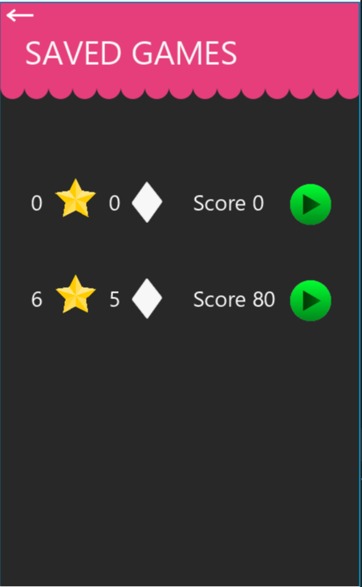
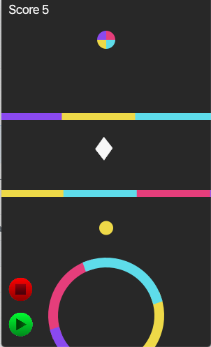
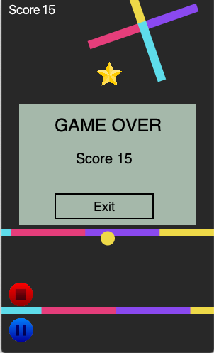
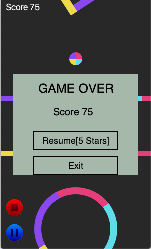
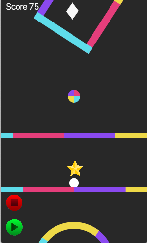
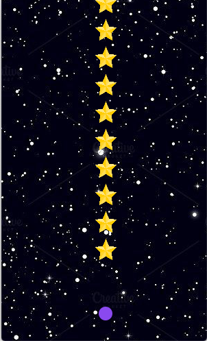
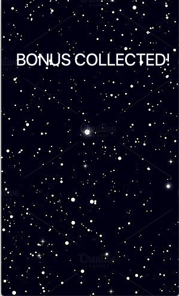
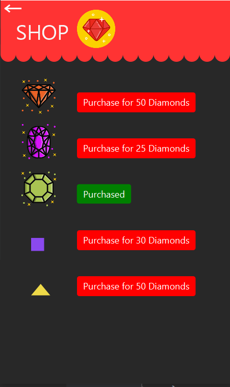
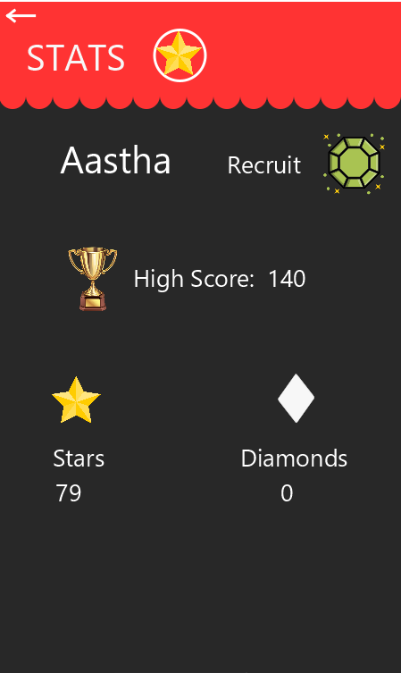
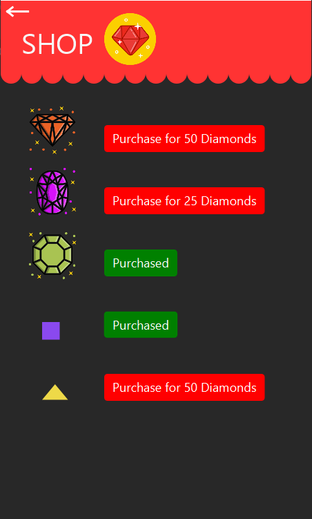
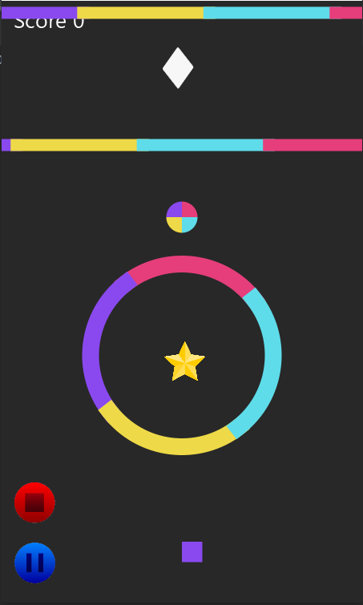
